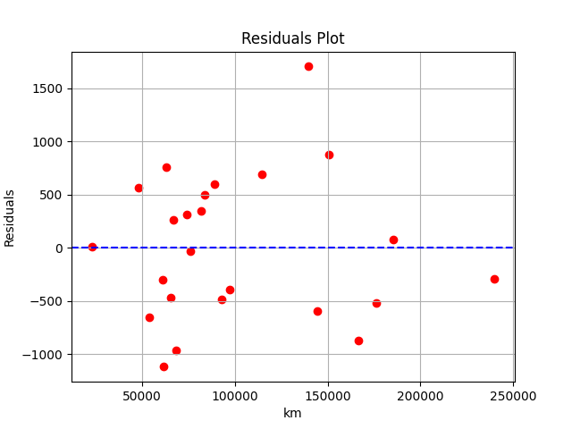

<h1 align="center">ft_linear_regression</h1>

<p align="center">
  
</p>

## An introduction to machine learning

### Summary
In this project, you will implement your first machine learning algorithm.

### Introduction
Machine learning is a growing field of computer science that may seem a bit complicated and reserved only to mathematicians. You may have heard of neural networks or k-means clustering and don’t understand how they work or how to code these kinds of algorithms... But don’t worry, we are actually going to start with a simple, basic machine learning algorithm.

### Objectives
The aim of this project is to introduce you to the basic concept behind machine learning. For this project, you will have to create a program that predicts the price of a car by using a [linear function](https://en.wikipedia.org/wiki/Linear_function) trained with a [gradient descent algorithm](https://en.wikipedia.org/wiki/Gradient_descent).

We will work on a precise example for the project, but once you’re done you will be able to use the algorithm with any other dataset.

### General Instructions
- You must create a program that predicts the price of a car by using a linear function.
- You are free to use any libraries you want as long as you can explain your choice, and they don't do all the work for you. For example, the use of Python's `numpy.polyfit` is considered cheating.
- You should use a language that you are comfortable with; the whole project must be written in the same language.

### Mandatory part
- You will implement a simple linear regression with a single feature - in this case, the mileage of the car.
    - The first program will be used to predict the price of a car for a given mileage. When you launch the program, it should prompt you for a mileage, and then give you back the estimated price for that mileage. The program will use the following hypothesis to predict the price:
        `estimatePrice(mileage) = θ0 + (θ1 * mileage)`
        Before the run of the training program, theta0 and theta1 will be set to 0.
    - The second program will be used to train your model. It will read your dataset file and perform a linear regression on the data. Once the linear regression has completed, you will save the variables θ0 and θ1 for use in the first program.

### Bonus
Here are some bonuses that could be very useful:
- Plotting the data into a graph to see their distribution.
- Plotting the line resulting from your linear regression into the same graph to see the result of your hard work!
- A program that calculates the precision of your algorithm.

### Usage
```sh
make run
```

### Additional Information
#### What is linear regression?

Linear regression is a linear approach to modeling the relationship between a scalar response (or dependent variable) and one or more explanatory variables (or independent variables). The case of one explanatory variable is called simple linear regression. For more than one explanatory variable, the process is called multiple linear regression.

In this project, we will use a simple linear regression with one feature to predict the price of a car.

#### What is a gradient descent algorithm?

Gradient descent is a first-order iterative optimization algorithm for finding a local minimum of a differentiable function. The idea is to take repeated steps in the opposite direction of the gradient (or approximate gradient) of the function at the current point, because this is the direction of the steepest descent.

In this project, we will use a gradient descent algorithm to find the best parameters for our linear function.

#### What is a linear function?

In mathematics, the term linear function refers to two distinct but related notions:

1. In calculus and related areas, a linear function is a polynomial function of degree zero or one, or is the zero polynomial. The function is of the form `f(x) = ax + b` and graphically produces a straight line.
2. In linear algebra, a linear function is a map `f : V → W` between two vector spaces that preserves vector addition and scalar multiplication. The function is of the form `f(x) = Ax` where `A` is a matrix and `x` is a vector.
3. In this project, we will use the first definition to create our linear function.
4. The linear function will be used to predict the price of a car based on its mileage.
5. The linear function will be trained using a gradient descent algorithm.
6. The linear function will be used to predict the price of a car for a given mileage.
7. The linear function will be saved to a file to be used later.

#### How are we Visualizing the data?

We will use a scatter plot to visualize the data. A scatter plot is a type of plot or mathematical diagram using Cartesian coordinates to display values for typically two variables for a set of data. If the points are coded (color/shape/size), one additional variable can be displayed. The data are displayed as a collection of points, each having the value of one variable determining the position on the horizontal axis and the value of the other variable determining the position on the vertical axis.


#### How are we Visualizing the linear regression?

We will use a line plot to visualize the linear regression. A line plot is a type of plot which displays information as a series of data points called 'markers' connected by straight line segments. It is a basic type of chart common in many fields. It is similar to a scatter plot except that the measurement points are ordered (typically by their x-axis value) and joined with straight line segments. A line plot should be used when the x-axis is a continuous variable.

#### What is the precision of the algorithm?

In the context of a machine learning algorithm, precision generally refers to how well the model's predictions match the actual values in the dataset. For a linear regression model, precision typically measures how closely the predicted prices of cars align with their actual prices based on the mileage.

#### How is Precision Calculated?

1. Prediction: First, the model predicts the prices of cars based on their mileage using the linear regression equation: predicted_price = theta0 + theta1 * mileage, where theta0 and theta1 are the parameters learned during training.
2. Comparison: Next, the predicted prices are compared with the actual prices in the dataset.
3. Error Calculation: The difference between the predicted prices and the actual prices is calculated for each car in the dataset. This difference is known as the error.
4. Precision: The precision of the algorithm is calculated based on the average error across all cars in the dataset. A lower average error indicates higher precision, while a higher average error indicates lower precision.

#### Interpretation of Precision
- High Precision: If the average error is low, the model's predictions are close to the actual prices, indicating high precision.
- Low Precision: If the average error is high, the model's predictions are far from the actual prices, indicating low precision.

#### How to Improve Precision?
- Feature Selection: Choosing the most relevant features (e.g., mileage, age, condition) for predicting car prices can improve precision.
- Model Complexity: Adjusting the complexity of the linear regression model (e.g., adding polynomial terms) can improve precision.
- Regularization: Applying regularization techniques (e.g., L1 or L2 regularization) to the linear regression model can improve precision.
- Data Cleaning: Removing outliers and cleaning the dataset can improve precision.
- Hyperparameter Tuning: Adjusting hyperparameters (e.g., learning rate, number of iterations) in the gradient descent algorithm can improve precision.


#### Mean Absolute Error (MAE)
MAE is the average absolute difference between the predicted and actual values. It provides a measure of the model's accuracy without considering the direction of the errors.

#### Mean Squared Error (MSE)
MSE is the average of the squared differences between the predicted and actual values. It penalizes larger errors more than MAE, making it sensitive to outliers.

#### R-squared (R²) Score
R² represents the proportion of the variance in the dependent variable that is predictable from the independent variable(s). An R² of 0.733 indicates that approximately 73.3% of the variance in the price can be explained by the kilometers. This is a relatively good fit, especially for real-world data, where an R² above 0.7 is often considered quite acceptable.


#### What is the significance of the R-squared value?
The R-squared value is a statistical measure that represents the proportion of the variance in the dependent variable that is predictable from the independent variable(s). In the context of linear regression, the R-squared value indicates how well the model fits the data. A higher R-squared value indicates a better fit, while a lower R-squared value indicates a poorer fit.


#### Key Features of a Residuals Plot
1. Residuals are randomly scattered around the horizontal axis: This indicates that the linear regression model is capturing the underlying patterns in the data.
2. Residuals are centered around zero: This indicates that the model is not systematically overestimating or underestimating the target variable.
3. Residuals are homoscedastic: This means that the variance of the residuals is constant across all levels of the target variable. If the residuals exhibit a pattern (e.g., a funnel shape), this indicates heteroscedasticity, which may suggest that the model is not appropriate for the data.



#### Interpretation of Residuals Plot
- Random Scatter: A random scatter of residuals around the horizontal axis indicates that the linear regression model is capturing the underlying patterns in the data.
- Centered Residuals: Residuals centered around zero indicate that the model is not systematically overestimating or underestimating the target variable.
- Homoscedastic Residuals: Homoscedastic residuals suggest that the variance of the residuals is constant across all levels of the target variable, indicating that the model is appropriate for the data.
- Heteroscedastic Residuals: Heteroscedastic residuals, characterized by a pattern (e.g., a funnel shape), suggest that the model may not be appropriate for the data, potentially requiring further investigation or model adjustments.
---
- Good Sign: A residuals plot with random scatter, centered residuals, and homoscedastic residuals is a good sign that the linear regression model is suitable for the data.
- Bad Sign: A residuals plot with non-random scatter, non-centered residuals, or heteroscedastic residuals may indicate issues with the model's fit to the data, requiring further analysis or model refinement.

---

#### Theta0 Theta1 over Iterations

The plot shows how the values of theta0 and theta1 change over the iterations of the gradient descent algorithm. The x-axis represents the number of iterations, while the y-axis represents the values of theta0 and theta1. The plot helps visualize the convergence of the algorithm and the values of theta0 and theta1 that minimize the cost function.


